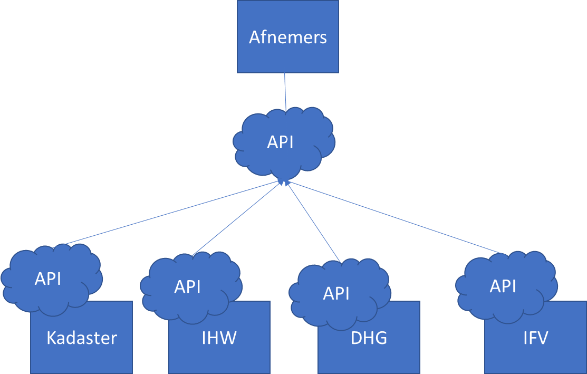
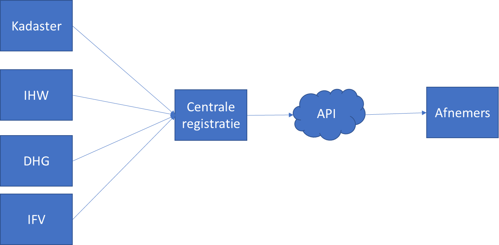
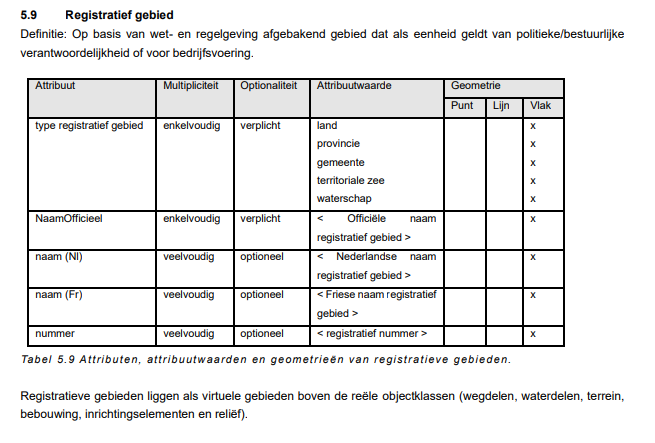

Beschrijving van bestuurlijke gebieden
======================================

Vanuit de doorontwikkeling van de geobasisregistraties in samenhang (DiS-Geo) is
de behoefte ontstaan om diverse bestuurlijke gebieden beter bruikbaar te maken
binnen de context van een samenhangend stelsel van geo-basisgegevens.
Voorbeelden van bestuurlijke gebieden, ookwel openbare lichaam, zijn Rijk,
gemeenten, provincies, waterschappen en samenwerkingsverbanden zoals
veiligheidsregio’s.

Daarnaast beschouwen we ook de grenzen op zee die de maritieme zones ruimtelijk
afbakenen ook als onderdeel van de bestuurlijke gebieden. Hieronder vallen de
territoriale zee, aansluitende en economische zone en het continentaal plat.

Gegevens over bestuurlijke gebieden kunnen in het huidige stelsel van
geobasisregistraties op meerdere plekken worden opgenomen, onder meer in de
Basisregistratie Kadaster (BRK) en Basisregistratie Grootschalige Topografie
(BGT). Elke basisregistratie doet dat op zijn eigen manier: met eigen
identificaties en eigenschappen.

In het document [‘DiS-Geo EMSO](https://docs.geostandaarden.nl/disgeo/emso/)’ is
gedefineerd welke wensen en eisen er zijn ten aanzien van inhoud van
bestuurlijke gebieden in de geobasisregistraties. Hierin worden onder meer
unieke aanduiding, naamgeving en relaties tot andere bestuurlijke gebieden
onderkend.

Gebruikers van deze gegevens zijn gebaat bij meer consistentie en samenhang in
de gegevens over en ontsluiting van bestuurlijke gebieden. Beoogde gebruikers
van bestuurlijke gebieden zijn onder meer vergunningverlening in het kader van
de Omgevingswet, Centraal Bureau voor de Statistiek (CBS), en
veiligheidheidsdiensten.

Het (keten)werkproces waarin bestuurlijke gebieden worden geproduceerd
======================================================================

Bestuurlijke gebieden worden op meerdere plekken bijgehouden en ontsloten. Hier
onder volgt een opsomming van de (keten)werkprocessen waarin bestuurlijke
gebieden worden geproduceerd

Bestuurlijke gebieden op land
-----------------------------

De gegevens over bestuurlijke gebieden op land, ofwel rijk op land, provincies,
gemeenten, waterschappen en veiligheidsregio’s worden als volgt geproduceerd.

### Rijk (land)

-   De grenzen worden in (internationale) verdragen formeel vastgesteld door het
    Rijk.

-   De grenzen *op land* worden (authentiek) vastgelegd in de BRK. Het Kadaster
    is bronhouder.

### Provincie

-   De grenzen worden vastgesteld door het Rijk. Ze worden (authentiek)
    vastgelegd in de BRK. Het Kadaster is bronhouder.

### Gemeente:

-   De grenzen worden vastgesteld door het Rijk. Ze worden (authentiek)
    vastgelegd in de BRK. Het Kadaster is bronhouder.

### Waterschap

-   De grenzen worden vastgesteld in provinciale verordeningen. Deze zijn echter
    nog niet eenduidig en volledig in beeld. De verkiezingsgrenzen (van de
    waterschappen als verkiezingsgebieden voor de waterschapsverkiezingen) zijn
    wel (niet-authentiek) vlakdekkend vastgelegd door de afzonderlijke
    waterschappen en eenmalige verzameld, samengevoegd en als losse dataset
    “Waterschapsgrenzen” ontsloten (o.a. via PDOK) door het waterschapshuis/unie
    van waterschappen. Tevens ontsluiten enkele provincies losse datasets met
    daarin de grenzen van de binnen hun provincie gelegen waterschappen.

-   De BGT biedt in het vrijwillige deel van IMGeo ook de mogelijkheid om
    waterschapsgrenzen vast te leggen.

### Veiligheidsregio

-   De grenzen worden vastgesteld in de

Bestuurlijke gebieden op zee
----------------------------

De gegevens over bestuurlijke gebieden op zee, ofwel de maritieme zones worden
als volgt geproduceerd.

### Maritieme zones

-   De grenzen *op zee* worden (authentiek) vastgelegd door de Dienst der
    Hydrografie (volgens IHO S-44 en S-57), en ontsloten middels losse datasets
    (grenzen aansluitende zone, grenzen exclusieve economische zone, grenzen
    territoriale zee, zones volgens het gemeenschappelijke visserijbeleid,
    grenzen volgens kaderrichtlijn water, Eems-Dollardverdrag en aanvullende
    overeenkomst, grenzen particularly sensitive Sea Area (PSSA) Waddenzee,
    Blokindeling Nederlands continentaal plat).

-   De maritieme zones worden gepubliceerd door de Dienst der Hydrografie van
    Defensie.

Stakeholders
============

### Bronhouders

Partijen die grenzen van bestuurlijke gebieden **inwinnen en/of bijhouden**
onder meer:

-   Kadaster

-   Ministerie Defensie

Partijen die gegevens van bestuurlijke gebieden **gebruiken** onder meer:

-   Alle partijen die behoefte hebben aan relatering aan locatie en gebied van
    bevoegd gezagen, werkingsgebieden en beheergebieden, onder meer
    veiligheidsdiensten, Digitaal Stelsel Omgevingswet (DSO), provincies,
    waterschappen, gemeenten.

-   Centraal Bureau Statistiek (CBS)

Partijen die de regelgeving, standaarden of centrale registratie voor gegevens
over bestuurlijke gebieden houden:

-   Kadaster

-   Geonovum

-   Ministerie van Binnenlandse Zaken

Bestaande softwaresystemen
==========================

In de volgende softwaresystemen worden in de bestaande situatie gegevens over
bestuurlijke gebieden ingewonnen, bijgehouden, geregistreerd, of beschikbaar
gesteld.

Landelijke Voorzieningen Kadaster
---------------------------------

In de landelijke voorzieningen van de BRK (Kadastrale Kaart), BGT en BRT wordt
de opname van bestuurlijke gebieden ondersteund:

-   In de BRK de grenzen van gemeenten, provincies en rijk op land.

-   In de BGT de grenzen van waterschappen.

-   In de BRT de gegeneraliseerde grenzen van gemeenten, provincies en rijk op
    land.

Waterschappen Administratieve eenheden INSPIRE WMS
--------------------------------------------------

Het Informatiehuis Water publiceert de grenzen van Waterschappen zijnde de
administratieve eenheden vanuit de INSPIRE-leververplichting middels een WMS.

BGT bronhoudersoftware
----------------------

De bronhouders van de BGT gebruiken software om objectgegevens conform de
BGT\|IMGeo standaarden bij te houden en aan te leveren aan de Landelijke
voorziening BGT, waaronder ook de mogelijkheid om grenzen van waterschappen te
leveren.

PDOK
----

Via [PDOK](https://www.pdok.nl/introductie/-/article/bestuurlijke-gebieden)
wordt de bestuurlijke indeling van Nederland in gemeenten, provincies alsmede de
landsgrens beschikbaar gesteld aan afnemers. Deze gegevens zijn afgeleid uit de
BRK:

Bestuurlijke grenzen API
------------------------

De [Bestuurlijke Grenzen
API](https://brk.basisregistraties.overheid.nl/bestuurlijke-grenzen-api) van het
Kadaster combineert de Rijksgrenzen (op land), provinciegrenzen en
gemeentegrenzen uit de BRK met de grenzen op zee van de Dienst der Hydrografie
en de waterschapsgrenzen van het waterschapshuis/unie van waterschappen.

Bestaande registraties
======================

Hieronder volgt een overzicht van de bestaande (basis)registraties waarin
gegevens over bestuurlijke gebieden zijn geregistreerd:

Basisregistratie Kadaster (BRK)
-------------------------------

De [Basisregistratie Kadaster
(BRK)](https://www.geobasisregistraties.nl/basisregistraties/kadaster) leidt
jaarlijks de dataset “Bestuurlijke Grenzen” af uit de kadastrale percelen. De
dataset bevat de landsgrens (behalve de zeegrenzen), provinciegrenzen,
gemeentegrenzen.

Basisregistratie Grootschalige Topografie (BGT)
-----------------------------------------------

De [Basisregistratie Grootschalige Topografie
(BGT)](https://www.geobasisregistraties.nl/basisregistraties/grootschalige-topografie)
biedt ruimte voor de vrijwillige vastlegging van waterschapsgrenzen. Van die
mogelijkheid wordt echter vrijwel geen gebruik gemaakt (0 in november 2019).

Basisregistatie Topografie (BRT)
--------------------------------

De [Basisregistatie Topografie
(BRT)](https://www.geobasisregistraties.nl/basisregistraties/topografie) bevat
de dataset “TopGrenzen” met de gegeneraliseerde gemeentegrenzen,
provinciegrenzen en de landsgrens (behalve die op zee). De grenzen worden
overgenomen uit de BRK en voor de toepasselijke kaartschaal gegeneraliseerd.

INSPIRE Administratieve eenheden
--------------------------------

De dataset Administratieve eenheden (INSPIRE geharmoniseerd) van het
Informatiehuis Water bevat ook de gemeente- en provinciegrenzen (evenals de
dataset “Bestuurlijke Grenzen”) maar dan INSPIRE geharmoniseerd.

Overige registraties
--------------------

Andere relevante registraties (voor Bestuurlijke Grenzen API nodig voor
koppeling met bevoegd gezag):

-   Centrale OIN raadpleegvoorziening Logius

-   CBS nummers gebieden

Wettelijk kader
===============

Hieronder volgt een opsomming van in welke wet- en regelgeving de indeling van
bestuurlijke gebieden is geregeld:

-   Kadasterwet (rijk, provincie en gemeente-grenzen)

-   Internationale verdragen (rijksgrenzen)

    -   Zee:
        <https://www.defensie.nl/onderwerpen/hydrografie/maritieme-zones-en-zeegrenzen/nederlandse-grenzen-op-de-noordzee>

    -   Provinciale verordeningen (waterschapsgrenzen)

-   [Artikel 123 van de
    Grondwet](https://wetten.overheid.nl/BWBR0001840/2018-12-21#Hoofdstuk7)
    regelt dat provincies en gemeenten bij wet kunnen worden
    opgeheven of ingesteld. In de [wet
    ARHI](https://wetten.overheid.nl/BWBR0003718) worden de algemene regels voor
    herindeling vastgelegd. Voor elke splitsing, samenvoeging, en grotere
    grenswijziging is in principe een aparte wet of rijksbesluit nodig. Kleinere
    grenswijzigingen kunnen met een provinciaal besluit worden ingesteld.

-   In de [Kadasterwet](https://wetten.overheid.nl/BWBR0004541/2021-07-01) wordt
    de inhoud van de basisregistraties Kadaster (BRK) en Topografie (BRT)
    geregeld door verwijzing in artikel 48 (BRK) en artikel 98a derde lid (BRT)
    naar een vast-te-stellen gegevenscatalogus.

-   De wet op de veiligheidsregio’s regelt in bijlage 1 de toewijzing van
    gemeenten aan een Veiligheidsregio. Bijlage bij artikel 8 Wet op de
    Veiligheidsregio’s:
    <https://wetten.overheid.nl/BWBR0027466/2021-07-01#Bijlage>

[Wet algemene regels
herindeling](http://www.parlementairemonitor.nl/9353000/1/j9vvij5epmj1ey0/vi32nmdf8gfh)

-   Het Zeeverdrag van de Verenigde Naties regelt de algemene indeling van
    maritieme zones. Waar maritieme zones van verschillende landen elkaar
    overlappen zijn er verdragen tussen deze landen, bijvoorbeeld
    Belgïe-Nederland en Duitsland-Nederland.

-   Landsgrenzen zijn vastgelegd in internationale verdragen:
    <https://www.centruminternationaalrecht.nl/landsgrenzen>

-   [Wet grenzen Nederlandse territoriale
    zee](https://wetten.overheid.nl/BWBR0003748/)

Relevante Standaarden
=====================

Hieronder volgt een opsomming van relevante standaarden

IMKAD 
------

het informatiemodel onder de Basisregistratie Kadaster. Kadaster is beheerder
van deze standaard.

<https://www.kadaster.nl/documents/1953498/2770003/BRK+Catalogus.pdf/ede17779-9298-c280-9997-788dd365a132?t=1632486527536>

IMGeo:

het informatiemodel onder de Basisregistratie Grootschalige Topografie. Geonovum
is beheerder van deze standaard.

IMBRT:

het informatiemodel onder de Basisregistratie Topografie. Kadaster is beheerder
van deze standaard.

Relevante documentatie
======================

Zie voor relevante documentatie de opsomming van wet- en regelgeving in
paragraaf

Inhoudelijke keuzes op hoofdlijnen
==================================

*Eigenlijk grenzen van openbare lichamen (zoals bedoeld in de Grondwet Hoofdstuk
7) en maritieme zones*

We kunnen dus bestuurlijke gebieden ‘op land’ en bestuurlijke gebieden ‘op zee’
onderscheiden. In het document ‘eisen aan inhoud’ voor een samenhangend stelsel
van geobasisgegevens (werktitel: sor) worden bestuurlijke gebieden als volgt
gedefineerd:

*Bestuurlijke gebieden zijn registratieve ruimten die op basis van wet- of
regelgeving als eenheid gelden van politiek/bestuurlijke verantwoordelijkheid.
Dit betreft bijvoorbeeld de gebieden behorende bij de vier formele bestuurslagen
uit de Grondwet (Rijk, provincie, waterschap, gemeente), maar kan ook gebieden
van bestuurlijke samenwerkingsverbanden met eigen politiek/bestuurlijke
verantwoordelijkheid omvatten. Een voorbeeld daarvan betreft de
veiligheidsregio’s*.

In het document ‘eisen aan inhoud’ voor een samenhangend stelsel van
geobasisgegevens worden de volgende bestuurlijke gebieden onderkend:

-   [Bestuurlijk
    gebied](https://docs.geostandaarden.nl/disgeo/emso/#bestuurlijk-gebied)

    -   [7.1.1Rijk](https://docs.geostandaarden.nl/disgeo/emso/#rijk)

    -   [7.1.2Provincie](https://docs.geostandaarden.nl/disgeo/emso/#provincie)

    -   [7.1.3Waterschap](https://docs.geostandaarden.nl/disgeo/emso/#waterschap)

    -   [7.1.4Gemeente](https://docs.geostandaarden.nl/disgeo/emso/#gemeente)

    -   [7.1.5Veiligheidsregio](https://docs.geostandaarden.nl/disgeo/emso/#veiligheidsregio)

-   [7.2Bestuurlijk gebied op
    zee](https://docs.geostandaarden.nl/disgeo/emso/#bestuurlijk-gebied-op-zee)

    -   [7.2.1Nederlandse territoriale
        zee](https://docs.geostandaarden.nl/disgeo/emso/#nederlandse-territoriale-zee)

    -   [7.2.2Nederlandse aansluitende
        zone](https://docs.geostandaarden.nl/disgeo/emso/#nederlandse-aansluitende-zone)

    -   [7.2.3Nederlandse exclusieve economische
        zone](https://docs.geostandaarden.nl/disgeo/emso/#nederlandse-exclusieve-economische-zone)

    -   [7.2.4Nederlandse continentaal
        plat](https://docs.geostandaarden.nl/disgeo/emso/#nederlandse-continentaal-plat)

Daarnaast worden andere registratieve gebieden/objecten onderkend, zijnde
Woonplaats, Wijk, Buurt, Openbare Ruimte, Nummeraanduiding, en Benoemde Plaats.
Deze registratieve gebieden vallen buiten de scope van bestuurlijke gebieden.

We hanteren deze indeling om per bestuurlijk gebied aan te geven, wie de
stakeholders zijn, hoe het ketenwerkproces verloopt, wat het wettelijk kader is,
en welke bestaande registraties en standaarden er zijn.

Deze verkenning betreft slechts het Europese grondgebied van het Koninkrijk der
Nederlanden, niet de overzeese gebiedsdelen. De vraag of de overzeese
gebiedsdelen meegaan in dit proces is een vraag die afzonderlijk beantwoordt
dient te worden door BZK.

Inhoud (Model)
--------------

**classDiagram**

    \_BestuurlijkGebied **\<\|--** Rijk

    \_BestuurlijkGebied **\<\|--** RijksgebiedOpLand

    \_BestuurlijkGebied **\<\|--** MaritiemeZoneOpZee

    \_BestuurlijkGebied **\<\|--** Provincie

    \_BestuurlijkGebied **\<\|--** Gemeente

    \_BestuurlijkGebied **\<\|--** Waterschap

    \_BestuurlijkGebied **\<\|--** Veiligheidsregio

    Rijk **\*--** RijksgebiedOpLand**:** isSamengesteldUit

    Rijk **\*--** MaritiemeZoneOpZee**:** isSamengesteldUit

    Rijk **\<--** Provincie**:** ligtIn

    Provincie **\<--** Gemeente**:** ligtIn

    Veiligheidsregio **\*--** Gemeente**:** isSamengesteldUit

    MaritiemeZoneOpZee **..** TypeMaritiemeZone

    TypeMaritiemeZone**: +**economische exclusieve zone

    TypeMaritiemeZone**: +**kustlijn

    \_BestuurlijkGebied **..** Status

    Status**: +**ontwerp

    Status**: +**aangewezen

    Status**: +**ingetrokken    

    \_BestuurlijkGebied **..** TijdlijnGeldigheid

    **class** TijdlijnGeldigheid **{**

        **+** beginGeldigheid**:** tijdstip

        **+** eindGeldigheid**:** tijdstip

    **}**

    **class** \_BestuurlijkGebied **{**

        **+**identificatie**:** id

        **+**bronhouder**:** code

        **+**status**:** Status

        **+**geldigheid**:** TijdlijnGeldigheid

        **+**naam**:** string

    **}**

    **class** Rijk **{**

        **+**geometrie**:** multigeometrie

    **}**

    Provincie

    **class** RijksgebiedOpLand **{**

        **+**geometrie**:** vlak

    **}**

    **class** MaritiemeZoneOpZee **{**

        **+**type**:** TypeMaritiemeZone

        **+**geometrie**:** vlak

    **}**

    **class** Veiligheidsregio **{**

        **+**code**:** Veiligheidsregiocode    

    **}**

    **class** Waterschap **{**

        **+**code**:** Waterschapscode

        geenGaten**()**

        geenOverlap**()**

    **}**

    **class** Provincie **{**

        **+**code**:** Provinciecode

        geenGaten**()**

        geenOverlap**()**

    **}**

    **class** Gemeente **{**

        **+**code**:** Gemeentecode

        geenGaten**()**

        geenOverlap**()**

    **}**

De volgende gegevens voor de modellering worden gemaakt:

-   Voor bestuurlijke gebieden op land worden de gegevens conform
    <https://docs.geostandaarden.nl/disgeo/emso/#bestuurlijk-gebied> opgenomen.

-   Voor bestuurlijke gebieden op zee worden de gegevens conform
    <https://docs.geostandaarden.nl/disgeo/emso/#bestuurlijk-gebied-op-zee>.

-   De topologische en adminstratieve relaties worden eveneens overgenomen uit
    <https://docs.geostandaarden.nl/disgeo/emso/#bestuurlijk-gebied> en
    <https://docs.geostandaarden.nl/disgeo/emso/#bestuurlijk-gebied-op-zee>

-   Elke bestuurlijk gebied

-   Elke bestuurlijk gebied krijgt een status, zijnde de fase van de
    levenscyclus. Voor levensfasen wordt de eisen uit
    <https://docs.geostandaarden.nl/disgeo/emso/#levensfasen> gehanteerd. In
    afwijking van dit document worden de volgende statussen gehanteerd voor een
    bestuurlijk gebied: ontwerp, **vastgesteld/aangewezen (vastgesteld),
    ingetrokken, ten onrechte opgevoerd (afgevoerd**).

Voorbeeld:

#### Purmerend

De gemeente Beemster wordt op 01-01-2022 middels een lichte samenvoeging
toegevoegd aan de gemeente Purmerend waarbij de gemeentecode van Purmerend
gehandhaafd blijft. De gemeentecode van de gemeente Beemster wordt met ingang
van 01 januari 2022 beëindigd.

Registratie

-   Een object Gemeente met naam ‘Purmerend’ en status ‘Aangewezen’ is
    geregistreerd met eindGeldigheid leeg; een object Gemeente met naam
    ‘Beemster’ en status ‘Aangewezen’ is geregistreerd met eindGeldigheid leeg.

-   Een object Gemeente met naam ‘Purmerend’ en status ‘Ontwerp’ wordt
    geregistreerd op 30-01-2018 met beginGeldigheid 29 januari 2018. De
    geometrie bestaat uit de samengestelde contour van Gemeente ‘Purmerend’
    ‘Aangewezen’ en Gemeente ‘Beemster’ ‘Aangewezen’.

-   Op 31-12-2021 wordt

-   Op 01-01-2022

Actualiteit (Model)
-------------------

Een bestuurlijk gebied dient voor de inwerkingtreding beschikbaar zijn. Een
voorlopige grens van een bestuurlijk gebied kan voor de inwerkingtreding worden
aangeleverd.

Bronhouders (juridisch)
-----------------------

| Rijk (grenzen op land) | Kadaster?                                                            |
|------------------------|----------------------------------------------------------------------|
| Provincie              | Kadaster?                                                            |
| Gemeente               | Kadaster?                                                            |
| Waterschap             | Unie van Waterschappen (Informatiehuis Water)                        |
| Veiligheidsregio       | Ministerie van Justitie en Veiligheid (Instituut Fysieke Veiligheid) |
| Rijk op zee            | Ministerie van Defensie (Dienst der Hydrografie)                     |
| Waterschap             | Unie van Waterschappen / Informatiehuis Water                        |

Inwinning
---------

-   Gegevens van Rijk, provincies en gemeenten worden afgeleid uit kadastrale
    percelen.

-   Gegevens over Maritieme zones op zee worden ingewonnen uit international
    verdragen.

-   Gegevens over Waterschappen worden ingewonnen via wet- en regelgeving /
    besluiten.

-   Gegevens over Veiligheidsregio worden ingewonnen via wet- en regelgeving.

Wijzigen en corrigeren van gegevens (Model + Voorzieningen)
-----------------------------------------------------------

Bestuurlijke gebieden met status ‘Ontwerp’ mogen worden gewijzigd. Er ontstaat
een nieuw voorkomen van dit object.

Gegevens van bestuurlijke gebieden met status ‘Aanwezen’ of ‘Ingetrokken’ mogen
niet worden gewijzigd (met uitzondering van de status). Deze objecten mogen wel
worden gecorrigeerd. Voor correctie wordt het oude object gewijzigd naar status
‘Ten onrechte opgevoerd’ met beginGeldigheid gelijk en nieuwe
tijdstipregsitratie. Er ontstaat een nieuwe versie in de registratie. Een nieuw
object met status ‘Aangewezen’ wordt opgevoerd met zelfde tijdstipregistratie

Correcties op gegevens zijn wel mogelijk.

Aanlevering en verstrekking (voorzieningen)
-------------------------------------------

**Optie 1:**

Elke bronhouder stelt zijn gegevens beschikbaar op de eigen server middels een
API.

Een API op de API’s levert de gegevens door afnemers.

**Optie 2:**

Elke bronhouder levert de gegevens aan een centrale registratie. Een API op de
centrale registratie levert de gegevens richting afnemers.

Bijlagen / overig te verwerken
==============================

**Normale basislijnen en rechte basislijnen**

Een basislijn is de lijn die de territoriale zee scheidt van het land en de
binnenwateren. Basislijnen staan centraal in het Zeerechtverdrag, omdat ze de
grondslag vormen voor de maritieme zones. Er zijn 2 soorten basislijnen:

-   **Rechte basislijnen**

Deze zijn bij wet vastgesteld. Rechte basislijnen geven aan waar de grens ligt
tussen de territoriale zee en de binnenwateren. Nederland heeft in 1985 rechte
basislijnen vastgesteld in de [Wet grenzen Nederlandse territoriale
zee](https://wetten.overheid.nl/BWBR0003748/1985-06-01).

-   **Normale basislijnen**

Een normale basislijn loopt daar waar de zee bij eb droogvalt (laagwaterlijn).
Deze 0-meter dieptelijnen zijn terug te vinden op de officiële zeekaarten van de
Dienst der Hydrografie. De meest recente kaarten met een schaal van uiterlijk
1:150.000, of hun digitale equivalent.

Grenscorrecties van gemeenten

Stakeholders

Bestaande softwaresystemen

Afbeelding met tafel Automatisch gegenereerde beschrijving

Afbeelding met tafel Automatisch gegenereerde beschrijving

Afbeelding met tafel Automatisch gegenereerde beschrijving

Afbeelding met tafel Automatisch gegenereerde beschrijving

registratieve gebieden. Registratieve gebieden liggen als virtuele gebieden
boven de reële objectklassen (wegdelen, waterdelen, terrein, bebouwing,
inrichtingselementen en reliëf).

BGT

INSPIRE

<https://www.nationaalgeoregister.nl/geonetwork/srv/dut/catalog.search#/metadata/2d4ec7e6-50ae-4c71-bd20-5b9211e2135f?tab=inspire>

Waterschapsgrenzen INSPIRE

De dataset geeft informatie over de waterschapsgrenzen.  
Waterschapsgrens: Grens van het grondgebied onder het bestuur van een
waterschap. Bron: AquoLex v11 (afgeleid) [www.aquo.nl](http://www.aquo.nl/)

Bestuurlijke grenzen

Bestuurlijke Grenzen bestaan uit de gemeente-, provincie- en rijksgrenzen. Deze
worden vervaardigd op basis van de kadastrale registratie (BRK). Jaarlijks wordt
de dataset geupdate.

<https://www.nationaalgeoregister.nl/geonetwork/srv/dut/catalog.search#/metadata/fe24c2a7-b121-4177-887a-fa16d943729b>

Wettelijk kader

De **bestuurlijke indeling
van **[Nederland](https://nl.wikipedia.org/wiki/Nederland) wordt geregeld in
hoofdstuk 7 van
de [Grondwet](https://nl.wikipedia.org/wiki/Nederlandse_Grondwet). Dit hoofdstuk
regelt de [provincies](https://nl.wikipedia.org/wiki/Provincies_van_Nederland),
de [gemeenten](https://nl.wikipedia.org/wiki/Nederlandse_gemeente),
de [waterschappen](https://nl.wikipedia.org/wiki/Waterschap) en de
andere [openbare
lichamen](https://nl.wikipedia.org/wiki/Openbaar_lichaam) alsmede de
gemeenschappelijke regelingen tussen de openbare
lichamen.[[1]](https://nl.wikipedia.org/wiki/Bestuurlijke_indeling_van_Nederland#cite_note-1)

-   *veiligheidsregio:* een openbaar lichaam als bedoeld in [artikel
    9](https://wetten.overheid.nl/BWBR0027466/2021-07-01#Paragraaf3_Artikel9);

Het **Zeerechtverdrag van de Verenigde Naties** – waarvan Nederland
verdragspartner is – maakt onderscheid tussen zeegebied binnen en buiten de
rechtsmacht van kuststaten. De Noordzee valt in zijn geheel binnen de
rechtsmacht van de omliggende kuststaten. De grenzen van het Nederlands deel van
de Noordzee zijn in 1958 vastgelegd in een verdrag met België, Duitsland en het
Verenigd Koninkrijk.

https://www.defensie.nl/onderwerpen/hydrografie/maritieme-zones-en-zeegrenzen

[Zeerechtverdrag](https://un.org/Depts/los/index.htm) van de Verenigde Naties.
Dat verdrag beschrijft de volgende zones:

-   de territoriale zee (tot 12 mijl uit de kust);

-   de aansluitende zone (12 tot 24 mijl uit de kust);

-   de exclusieve economische zone (tot 200 mijl uit de kust);

-   het continentaal plat (de zeebodem).

Daar waar gebieden overlappen zijn de grenzen vastgelegd in overeenkomsten ofwel
verdragen:

Territoriale zee Nederland België

Grenzen continentaal plat zijn vastgelegd in overeenkomsten c.q. verdragen.

Kadastraal object heeft 1..1 gemeentecode.

De volgende (bijzondere) gemeenten worden sinds 2010 als openbaar lichaam
bestuurd:

-   [Bonaire](https://nl.wikipedia.org/wiki/Bonaire)

-   [Sint Eustatius](https://nl.wikipedia.org/wiki/Sint_Eustatius)

-   [Saba](https://nl.wikipedia.org/wiki/Saba)

Bonaire, Sint Eustatius en Saba, ook wel de BES-eilanden genoemd, liggen
in [Caribisch Nederland](https://nl.wikipedia.org/wiki/Caribisch_Nederland); ze
worden afzonderlijk van elkaar bestuurd.

De Nederlandse
gemeente [Kerkrade](https://nl.wikipedia.org/wiki/Kerkrade_(gemeente)) en Duitse
gemeente 's-Hertogenrade (Herzogenrath) vormen samen een grensoverschrijdend
openbaar lichaam:

-   [Eurode](https://nl.wikipedia.org/wiki/Eurode) (sinds
    1998)[[1]](https://nl.wikipedia.org/wiki/Openbaar_lichaam#cite_note-1)

De volgende organisaties worden als openbaar lichaam bestuurd:

-   veel publiekrechtelijke samenwerkingen op basis van de [Wet
    gemeenschappelijke
    regelingen](https://nl.wikipedia.org/wiki/Wet_gemeenschappelijke_regelingen) (Wgr)

-   [Veiligheidsregio](https://nl.wikipedia.org/wiki/Veiligheidsregio)**'s**

-   [Nederlandse Orde van
    Advocaten](https://nl.wikipedia.org/wiki/Nederlandse_Orde_van_Advocaten) (1952)

-   [Orde van
    Octrooigemachtigden](https://nl.wikipedia.org/wiki/Octrooigemachtigde)

-   [Nederlandse
    Loodsencorporatie](https://nl.wikipedia.org/w/index.php?title=Nederlandse_Loodsencorporatie&action=edit&redlink=1) (NLC,

-   [Koninklijke Notariële
    Beroepsorganisatie](https://nl.wikipedia.org/wiki/Koninklijke_Notari%C3%ABle_Beroepsorganisatie) (1999)

-   [Koninklijke Beroepsorganisatie van
    Gerechtsdeurwaarders](https://nl.wikipedia.org/w/index.php?title=Koninklijke_Beroepsorganisatie_van_Gerechtsdeurwaarders&action=edit&redlink=1) (KBvG)

-   [Nederlandse Beroepsorganisatie van
    Accountants](https://nl.wikipedia.org/wiki/Nederlandse_Beroepsorganisatie_van_Accountants) (NBA,

    1.  (sinds 2015: [Koninklijke Nederlandse Beroepsorganisatie van
        Accountants](https://nl.wikipedia.org/wiki/Koninklijke_Nederlandse_Beroepsorganisatie_van_Accountants),
        KNBA)

-   [Arbeidsvoorzieningsorganisatie](https://nl.wikipedia.org/w/index.php?title=Arbeidsvoorzieningsorganisatie&action=edit&redlink=1) (1990)

-   [Gezamenlijke
    Brandweer](https://nl.wikipedia.org/wiki/Gezamenlijke_Brandweer) Rotterdam-Rijnmond

-   [Omgevingsdiensten](https://nl.wikipedia.org/w/index.php?title=Omgevingsdienst&action=edit&redlink=1) (sinds
    1 april 2013, ter regionale uitvoering van bestuurlijke bevoegdheden op
    grond van Wabo)

[Wet algemene regels
herindeling](http://www.parlementairemonitor.nl/9353000/1/j9vvij5epmj1ey0/vi32nmdf8gfh)

Relevante standaarden

Relevante documentatie

Inhoudelijke keuzes op hoofdlijnen

Beperking tot grondgebied van Nederland m.u.v. overzeese gebieden. Bijzondere
gemeenten zijn buitenscope

Aanpak en langetermijnplanning
