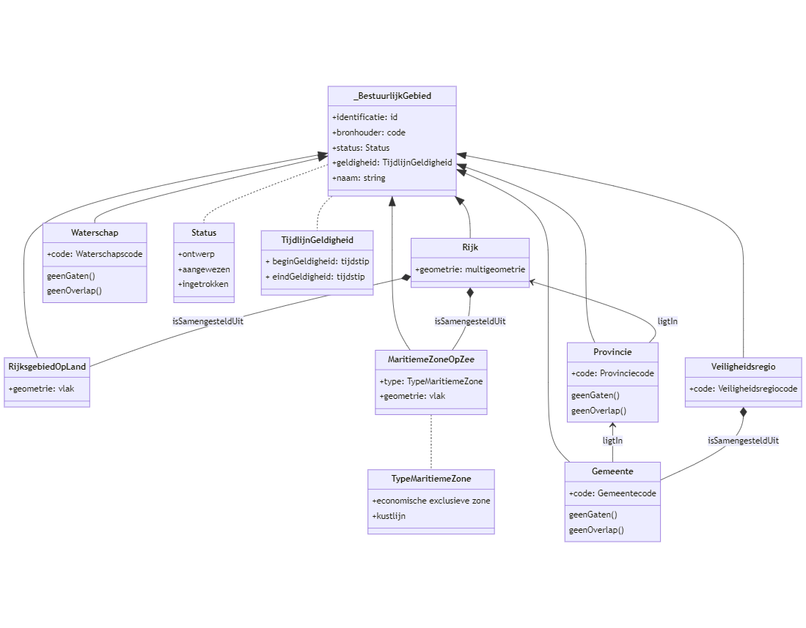

Inleiding
=========

Dis-Geo wordt ontwikkeld in een scaled agile framework (SAFe) aanpak. Dat wil zeggen meerdere AGILE werkende teams produren samen het geheel. Standaarden worden dus ook op AGILE wijze in sprints gemaakt. We werken de bestuurlijke gebieden op basis van het document [‘DiS-Geo
EMSO](https://docs.geostandaarden.nl/disgeo/emso/)’ en dit scopedocument uit in een informatiemodel en een registratievoorziening. Hieruit kunnen vragen over onder meer processen,
bronhouderschap, brondocumenten en andere juridische aspecten naar voren komen
die in een later stadium worden uitgewerkt.

Geonovum levert de volgende producten op:
* Model van  begrippen, dat wil zeggen relevante begrippen en hun definities. In eerste instantie gepubliceerd op begrippen.geostandaarden.nl. Bij formele in productiename van bestuurlijke gebieden verhuist dit model van begrippen naar definities.geostandaarden.nl.
* Conceptueel informatiemodel. Een implementatie onafhankelijk informatiemodel waarin in UML de samenhang van de begrippen gemodelleerd is. Inclusief tekstuele toelichting gepubliceeerd in ReSpec formaat op docs.geostandaarden.nl
* Logisch informatiemodel. Een UML model afgeleid van het conceptuele UML model waarin implementatiekeuzes zijn gemaakt. Dit wordt gebruikt voor afleiden van technische specificaties
* Technische specificaties: Een API beschrijving in OAS 3 formaat in lijn met de REST API Design Rules welke de interface van de API definieerd. Daarnaast een JSON schema bestand waarmee de uitgewisselde informatie in JSON formaat gevalideerd kan worden. Waar nodig uitgebreid met aanvullende tekstuele documentatie.
* Scope document: Dit document zelf.
* Geleerde lessen: Aan de hand van een evaluatie moment worden geleerde lessen van het project gedocumenteerd en waar van toepassing worden change requests aan bestaande registraties geformuleerd.

Het model van begrippen, conceptueel informatiemodel en scopedocument zullen door de governance van DiS Geo worden vastgesteld. Het scopedocument aan het begin van het project en de modellen aan het einde van het project.

Dese eerste versie van bestuurlijke gebieden gaat over:
* Rijk (land)
* Provincie
* Gemeente
* Waterschap
* Veiligheidsregio
* Maritieme zones

Overzeese gebiedsdelen, ondergrond(bijv. mijnbouw) en het luchtruim zijn buiten scope.

Stakeholders
============

### Bronhouders

Partijen die grenzen van bestuurlijke gebieden **inwinnen en/of bijhouden**
zijn onder meer:

-   Kadaster

-   Ministerie van Defensie (Dienst der Hydrografie)

### Afnemers
Partijen die gegevens van bestuurlijke gebieden **gebruiken** zijn onder meer:

-   Alle partijen die behoefte hebben aan relatering aan locatie en gebied van
    bevoegd gezagen, werkingsgebieden en beheergebieden, onder meer
    veiligheidsdiensten, Digitaal Stelsel Omgevingswet (DSO), provincies,
    waterschappen, gemeenten.

-   Bronhouder BAG voor het voldoen aan de eis dat het grondgebied van de
    gemeente volledig bedekt is met woonplaatsen.

-   Centraal Bureau Statistiek (CBS)

### Beheerders 
Partijen die de **regelgeving, standaarden, of centrale voorzieningen** voor
gegevens over bestuurlijke gebieden beheren:

-   Kadaster / PDOK

-   Geonovum

-   Ministerie van Binnenlandse Zaken en Koninkrijksrelaties

Bestaande registraties
======================

Hieronder volgt een overzicht van de bestaande (basis)registraties waarin
gegevens over bestuurlijke gebieden zijn geregistreerd:

Basisregistratie Kadaster (BRK)
-------------------------------

De [Basisregistratie Kadaster
(BRK)](https://www.geobasisregistraties.nl/basisregistraties/kadaster) leidt
jaarlijks de dataset “Bestuurlijke Grenzen” af uit de kadastrale percelen. De
dataset bevat de landsgrens (behalve de zeegrenzen), provinciegrenzen,
gemeentegrenzen.

Basisregistratie Grootschalige Topografie (BGT)
-----------------------------------------------

De [Basisregistratie Grootschalige Topografie
(BGT)](https://www.geobasisregistraties.nl/basisregistraties/grootschalige-topografie)
biedt ruimte voor de vrijwillige vastlegging van waterschapsgrenzen. Van die
mogelijkheid wordt echter vrijwel geen gebruik gemaakt (0 in november 2019).

Basisregistratie Topografie (BRT)
--------------------------------

De [Basisregistratie Topografie
(BRT)](https://www.geobasisregistraties.nl/basisregistraties/topografie) bevat
de dataset “TopGrenzen” met de gegeneraliseerde gemeentegrenzen,
provinciegrenzen en de landsgrens (behalve die op zee). De grenzen worden
overgenomen uit de BRK en voor de toepasselijke kaartschaal met de onderliggende topografie als basis gegeneraliseerd.

INSPIRE Administratieve eenheden
--------------------------------

De dataset Administratieve eenheden (INSPIRE geharmoniseerd) van het
Informatiehuis Water bevat ook de gemeente- en provinciegrenzen (evenals de
dataset “Bestuurlijke Grenzen”) maar dan INSPIRE geharmoniseerd.

Nederlandse grenzen op de Noordzee
----------------------------------

Defensie stelt de [Nederlandse grenzen op de
Noordzee](https://www.defensie.nl/onderwerpen/hydrografie/maritieme-zones-en-zeegrenzen/nederlandse-grenzen-op-de-noordzee)
samen en beschikbaar.

Overige registraties
--------------------

Andere relevante registraties (voor Bestuurlijke Grenzen API nodig voor
koppeling met bevoegd gezag):

-   Centrale OIN raadpleegvoorziening Logius

-   CBS nummers gebieden

Wettelijk kader
===============

Hieronder volgt een (niet-uitputtende) opsomming van in welke wet- en
regelgeving de indeling van bestuurlijke gebieden is geregeld.

Grondwet
--------

De **bestuurlijke indeling
van **[Nederland](https://nl.wikipedia.org/wiki/Nederland) wordt geregeld in
hoofdstuk 7 van
de [Grondwet](https://nl.wikipedia.org/wiki/Nederlandse_Grondwet). Dit hoofdstuk
regelt de [provincies](https://nl.wikipedia.org/wiki/Provincies_van_Nederland),
de [gemeenten](https://nl.wikipedia.org/wiki/Nederlandse_gemeente),
de [waterschappen](https://nl.wikipedia.org/wiki/Waterschap) en de
andere [openbare
lichamen](https://nl.wikipedia.org/wiki/Openbaar_lichaam) alsmede de
gemeenschappelijke regelingen tussen de openbare lichamen.

-   *veiligheidsregio:* een openbaar lichaam als bedoeld in [artikel
    9](https://wetten.overheid.nl/BWBR0027466/2021-07-01#Paragraaf3_Artikel9);

[Artikel 123 van de
Grondwet](https://wetten.overheid.nl/BWBR0001840/2018-12-21#Hoofdstuk7)
regelt dat provincies en gemeenten bij wet kunnen worden opgeheven of ingesteld.
In de [wet ARHI](https://wetten.overheid.nl/BWBR0003718) worden de algemene
regels voor herindeling vastgelegd. Voor elke wijziging van de indeling (splitsing, samenvoeging, en
grotere grenswijziging) is in principe een aparte wet of rijksbesluit nodig.
Grenscorrecties (kleinere grenswijzigingen) kunnen met een provinciaal besluit worden ingesteld.

Kadasterwet
-----------

In de [Kadasterwet](https://wetten.overheid.nl/BWBR0004541/2021-07-01) wordt de
inhoud van de basisregistraties Kadaster (BRK) en Topografie (BRT) geregeld door
verwijzing in artikel 48 (BRK) en artikel 98a derde lid (BRT) naar een
vast-te-stellen gegevenscatalogus. In de Kadasterwet worden daarmee de grenzen
van rijk (op land), provincie en gemeente juridisch verankerd.

Wet Basisregistratie Grootschalige Topografie(BGT)
--------------------------------------------------
De wet BGT regelt niets over de vrijwillige waterschaps wensen dat is het optionele deel van IMGeo en geen onderdeel van de wet.

**aanvullen met wet BGT voor vrijwillige waterschapsgrenzen?**

Internationale verdragen
------------------------

Het [Zeerechtverdrag](https://un.org/Depts/los/index.htm) van de Verenigde
Naties regelt de algemene indeling van maritieme zones. Waar maritieme zones van
verschillende landen elkaar overlappen zijn er verdragen tussen deze landen,
bijvoorbeeld Belgïe-Nederland en Duitsland-Nederland. Het Zeerechtverdrag
beschrijft de volgende zones:

-   de territoriale zee (tot 12 mijl uit de kust);

-   de aansluitende zone (12 tot 24 mijl uit de kust);

-   de exclusieve economische zone (tot 200 mijl uit de kust);

-	

Daar waar gebieden overlappen zijn de grenzen vastgelegd in bilaterale
overeenkomsten ofwel verdragen tussen landen.

Landsgrenzen zijn vastgelegd in [internationale
verdragen](https://www.centruminternationaalrecht.nl/landsgrenzen).

[Wet grenzen Nederlandse territoriale zee](https://wetten.overheid.nl/BWBR0003748/)
-----------------------------------------------------------------------------------

De wet grenzen Nederlandse territoriale zee is een uitwerking van internationale
verdragen in nationale wetgeving.

[Wet algemene regels herindeling](http://www.parlementairemonitor.nl/9353000/1/j9vvij5epmj1ey0/vi32nmdf8gfh)
------------------------------------------------------------------------------------------------------------

Provinciale verordeningen (waterschapsgrenzen)
----------------------------------------------

Wet op de veiligheidsregio’s
----------------------------

-   De wet op de veiligheidsregio’s regelt in [de bijlage bij artikel 8](https://wetten.overheid.nl/BWBR0027466/2021-07-01#Bijlage) de toewijzing van
    gemeenten aan een Veiligheidsregio.
	
Omgevingswet
------------
De omgevingswet noemt de bestuurlijke grenzen niet expliciet, maar bij de uitvoering van de wet zijn ze van groot belang. De landelijke voorziening(voor omgevingsplannen) werkt niet wanneer de bestuurlijke grenzen API niet beschikbaar is.

Beschrijving van bestuurlijke gebieden
======================================

Vanuit de doorontwikkeling van de geobasisregistraties in samenhang (DiS-Geo) is
de behoefte ontstaan om diverse bestuurlijke gebieden beter bruikbaar te maken
binnen de context van een samenhangend stelsel van geo-basisgegevens.
Voorbeelden van bestuurlijke gebieden zijn gebieden die behoren bij de openbare lichamen Rijk,
gemeenten, provincies, waterschappen en samenwerkingsverbanden zoals
veiligheidsregio’s. Het gaat hier dus *niet* om de openbare lichamen zelf maar alléén om het gebied waar binnen het openbare lichaam haar bestuurlijke verantwoordelijkheid uitoefent. 

Daarnaast beschouwen we ook de grenzen op zee die de maritieme zones ruimtelijk
afbakenen als onderdeel van de bestuurlijke gebieden. Hieronder vallen de
territoriale zee, aansluitende en economische zone en het continentaal plat.

Gegevens over bestuurlijke gebieden kunnen in het huidige stelsel van
geobasisregistraties op meerdere plekken worden opgenomen, onder meer in de
Basisregistratie Kadaster (BRK) en Basisregistratie Grootschalige Topografie
(BGT). Elke basisregistratie doet dat op zijn eigen manier: met eigen
identificaties en eigenschappen.

In het document [‘DiS-Geo EMSO](https://docs.geostandaarden.nl/disgeo/emso/)’ is
gedefinieerd welke wensen en eisen er zijn ten aanzien van inhoud van
bestuurlijke gebieden in de geobasisregistraties. Hierin worden onder meer
unieke aanduiding, naamgeving en relaties tot andere bestuurlijke gebieden
onderkend.

Gebruikers van deze gegevens zijn gebaat bij meer consistentie en samenhang in
de gegevens over en ontsluiting van bestuurlijke gebieden. Beoogde gebruikers
van bestuurlijke gebieden zijn onder meer vergunningverleners in het kader van
de Omgevingswet, Centraal Bureau voor de Statistiek (CBS), en
veiligheidsdiensten.

Het (keten)werkproces waarin bestuurlijke gebieden worden geproduceerd
======================================================================

Bestuurlijke gebieden worden op meerdere plekken bijgehouden en ontsloten. Hier
onder volgt een opsomming van de (keten)werkprocessen waarin bestuurlijke
gebieden worden geproduceerd

Bestuurlijke gebieden op land
-----------------------------

De gegevens over bestuurlijke gebieden op land, ofwel rijk op land, provincies,
gemeenten, waterschappen en veiligheidsregio’s worden als volgt geproduceerd.

### Rijk (land)

-   De grenzen worden in (internationale) verdragen formeel vastgesteld door het
    Rijk.

-   De grenzen *op land* worden (authentiek) vastgelegd in de BRK. Het Kadaster
    is bronhouder.

### Provincie

-   De grenzen worden vastgesteld door het Rijk. Ze worden (authentiek)
    vastgelegd in de BRK. Het Kadaster is bronhouder.

### Gemeente:

-   De grenzen worden vastgesteld door het Rijk. Ze worden (authentiek)
    vastgelegd in de BRK. Het Kadaster is bronhouder.

### Waterschap

-   De grenzen worden vastgesteld in provinciale verordeningen. Deze zijn echter
    nog niet eenduidig en volledig in beeld. De verkiezingsgrenzen (van de
    waterschappen als verkiezingsgebieden voor de waterschapsverkiezingen) zijn
    wel (niet-authentiek) vlakdekkend vastgelegd door de afzonderlijke
    waterschappen en eenmalige verzameld, samengevoegd en als losse dataset
    “Waterschapsgrenzen” ontsloten (o.a. via PDOK) door het Waterschapshuis/ Unie
    van waterschappen. Tevens ontsluiten enkele provincies losse datasets met
    daarin de grenzen van de binnen hun provincie gelegen waterschappen.

-   De BGT biedt in het vrijwillige deel van IMGeo ook de mogelijkheid om
    waterschapsgrenzen vast te leggen.

### Veiligheidsregio

-   De grenzen worden vastgesteld met een Algemene maatregel van Bestuur op basis van de Wet op de Veiligheidsregio’s.

Bestuurlijke gebieden op zee
----------------------------

De gegevens over bestuurlijke gebieden op zee, ofwel de maritieme zones worden
als volgt geproduceerd.

### Maritieme zones

-   De grenzen *op zee* worden (authentiek) vastgelegd door de Dienst der
    Hydrografie (volgens IHO S-44 en S-57), en ontsloten middels losse datasets
    (grenzen aansluitende zone, grenzen exclusieve economische zone, grenzen
    territoriale zee, zones volgens het gemeenschappelijke visserijbeleid,
    grenzen volgens kaderrichtlijn water, Eems-Dollardverdrag en aanvullende
    overeenkomst, grenzen particularly sensitive Sea Area (PSSA) Waddenzee,
    Blokindeling Nederlands continentaal plat).

-   De maritieme zones worden gepubliceerd door de Dienst der Hydrografie van
    Defensie.

Bestaande softwaresystemen
==========================

In de volgende softwaresystemen worden in de bestaande situatie gegevens over
bestuurlijke gebieden ingewonnen, bijgehouden, geregistreerd, of beschikbaar
gesteld.

Landelijke Voorzieningen Kadaster
---------------------------------

In de landelijke voorzieningen van de BRK (Kadastrale Kaart), BGT en BRT wordt
de opname van bestuurlijke gebieden ondersteund:

-   In de BRK de grenzen van gemeenten, provincies en rijk op land.

-   In de BGT de grenzen van waterschappen.

-   In de BRT de gegeneraliseerde grenzen van gemeenten, provincies en rijk op
    land.

Waterschappen Administratieve eenheden INSPIRE WMS
--------------------------------------------------

Het Informatiehuis Water publiceert de grenzen van Waterschappen zijnde de
administratieve eenheden vanuit de INSPIRE-leververplichting middels een WMS.

BGT bronhoudersoftware
----------------------

De bronhouders van de BGT gebruiken software om objectgegevens conform de
BGT\|IMGeo standaarden bij te houden en aan te leveren aan de Landelijke
voorziening BGT, waaronder ook de mogelijkheid om grenzen van waterschappen te
leveren.

PDOK
----

Via [PDOK](https://www.pdok.nl/introductie/-/article/bestuurlijke-gebieden)
wordt de bestuurlijke indeling van Nederland in gemeenten, provincies alsmede de
landsgrens beschikbaar gesteld aan afnemers. Deze gegevens zijn afgeleid uit de
BRK:

Bestuurlijke grenzen API
------------------------

De [Bestuurlijke Grenzen
API](https://brk.basisregistraties.overheid.nl/bestuurlijke-grenzen-api) van het
Kadaster combineert de Rijksgrenzen (op land), provinciegrenzen en
gemeentegrenzen uit de BRK met de grenzen op zee van de Dienst der Hydrografie
en de waterschapsgrenzen van het Waterschapshuis/ Unie van waterschappen.

Relevante Standaarden
=====================

Hieronder volgt een opsomming van relevante standaarden

IMKAD
-----

Is het
[informatiemodel](https://www.kadaster.nl/documents/1953498/2770003/BRK+Catalogus.pdf/ede17779-9298-c280-9997-788dd365a132?t=1632486527536)
onder de Basisregistratie Kadaster. Kadaster is beheerder van deze standaard.

IMGeo
-----

Is het informatiemodel onder de Basisregistratie Grootschalige Topografie.
Geonovum is beheerder van deze standaard.

IMBRT
-----

Is het informatiemodel onder de Basisregistratie Topografie. Kadaster is
beheerder van deze standaard.

Informatie modellering
----------------------
NEN3610, MIM 1.1.1 **verder uitwerken**

Relevante architectuur
======================

NORA DSO **verder uitwerken**

Inhoudelijke keuzes op hoofdlijnen
==================================

Hieronder worden een aantal inhoudelijke keuzes op hoofdlijnen opgesomd ten
behoeve van de informatiemodellering voor bestuurlijke gebieden.

Aanpak
------

Voor nu wordt er voor gekozen om bestuurlijke gebieden in een apart klein
informatiemodel te modelleren. Op later moment kan worden bekeken of dit
informatiemodel wordt geïntegreerd in bijvoorbeeld BRK of BGT.
In eerste instantie worden de resultaten in de Bestuurlijke gebieden API van het Kadaster verwerkt. Geonovum werkt in sprints aan de standaard waarbij we ons sprintritme afstemmen op dat van het Kadaster bestuurlijke gebieden API team. We maken meerdere iteraties van de standaard, die minimaal door de bestuurlijke gebieden API wordt geïmplementeerd. Bij voorkeur worden deze in de keten getest door zowel bronhouders als afnemers.

Aanspreek punt voor architectuur vragen die naar boven komen in het standaardisatie project is de architect van het Kadaster. Dit aangezien Kadaster beoogd is als verantwoordelijk voor het realiseren van de standaard in een landelijke voorziening.

Uitgangspunt is dat het informatiemodel moet kunnen werken op basis van nu geldige wettelijke context van bronregistraties (BRK, BRT, BGT,...). Alle uitbreidingen daarop in het informatiemodel moeten optioneel zijn. 
We gaan er vanuit dat de huidige Informatiemodellen van BRK, BGT en BRT niet op korte termijn veranderen.

In de eerste versie van bestuurlijke gebieden gaan we uit van bestaande wettelijke kaders. Een volgende stap kan zijn om wettelijke kaders aan te passen (nu buiten scope) In dat (toekomstige) geval moeten bij implementatie c.q. formele ingangsdatum van het ‘informatiemodel
bestuurlijke gebieden’ dienen andere informatiemodellen de bestuurlijke gebieden
te schrappen, bijvoorbeeld Gemeente uit BRK en/of Waterschap uit IMGeo.

**is dit te rijmen met uitgangspunt over wettelijke kaders? voorstel is om deze allinea te schrapen of dit punt buiten scope van het huidige proect te zetten**

Inhoud
------

De volgende bestuurlijke gebieden zijn in scope: De gebieden van Rijk, Provincie, Gemeente,
Waterschap, Veiligheidsregio, en de Maritieme zones bestaande uit de Nederlandse
territoriale zee, Nederlandse aansluitende zone, Nederlandse exclusieve
economische zone, Nederlandse continentaal plat.

buitenscope: het modelleren van grenzen met betrekking tot Luchtruim en Mijnbouw, overzeese gebiedsdelen.

In het document [‘DiS-Geo EMSO](https://docs.geostandaarden.nl/disgeo/emso/)’
wordt object Rijk onderkend als het rijksgebied op land. Aandachtspunt bij de
modellering is dat Rijk samengesteld is uit rijksgrens/-gebied op land (huidige
Rijksgrens in BRK) en rijksgrenzen/-gebieden op zee (huidige maritieme zones van
Defensie).

Dekking
-------

De regels voor opname van bestuurlijke gebieden worden afgebakend tot dekking
voor het Nederlands grondgebied zonder overzeese gebieden. Bij de uitwerking in
het informatiemodel en voorzieningen dient rekening te worden gehouden met
uitbreiding van eventuele exclaves (Baarle-Hertog) en/of BES eilanden op een later
moment.

Uitbreiding
-----------

In de modellering moet rekening worden gehouden dat het model -naast
ondersteuning van veiligheidsregio’s- ook uitgebreid kan worden met andere
openbare lichamen zoals gemeentelijke samenwerkingsverbanden.

De overage registratieve ruimten die in document [‘DiS-Geo
EMSO](https://docs.geostandaarden.nl/disgeo/emso/)’ onderkend worden, zijnde
Woonplaats, Wijk, Buurt, Openbare Ruimte, Nummeraanduiding, en Benoemde Plaats
vallen (nu) buiten de scope van het informatiemodel bestuurlijke gebieden.
Relaties met andere objecten (bijv. Woonplaats, Wijk) kunnen wel worden
benoemd/geschetst, maar worden niet nader uitgewerkt in het informatiemodel.
Het model moet zo opgezet worden dat het in een later stadium hierop uitbreidbaar is.

Levensloop
----------

Elke bestuurlijk gebied krijgt een status, zijnde de fase van de levenscyclus.
In afwijking van het document ‘DiS-Geo EMSO’ worden de volgende statussen
gehanteerd voor een bestuurlijk gebied:

-   ontwerp

-   aangewezen

-   ingetrokken

-   ten onrechte opgevoerd

Aangewezen en ten onrechte opgevoerd bestaan niet in EMSO en we implementeren er twee niet uit EMSO.
De afwijking van EMSO is noodzakelijk om dichter bij de wet en rgelgeving van bestaande registraties te blijven. Aangezien we de bestaande wet en regelgeving als uitgangspunt nemen voor deze versie van bestuurlijke gebieden.

Actualiteit
-----------

Een bestuurlijk gebied dient voor de inwerkingtreding beschikbaar te zijn. Een
voorlopige grens van een bestuurlijk gebied kan voor de inwerkingtreding worden
aangeleverd.

Kwaliteit
-----------
De NORA is leidend voor het bepalen van kwaliteitsaspecten. De nora de volgende kwaliteitsdimensies:

| Kwaliteitsdimensie  | Definitie              |
| ------------------- | ---------------------- |
| Juistheid	| De mate waarin gegevens de echte waarde goed weergeven.|
| Compleetheid |	De mate waarin gegevens aanwezig zijn.|
| Validiteit |	De mate waarin gegevens voldoen aan de verwachte structuur en opslagvorm.|
| Consistentie	| De mate waarin gegevens vrij van tegenspraak zijn en samenhang vertonen met andere gegevens |
| Actualiteit | De mate waarin gegevens recent genoeg zijn.|
| Precisie	| De mate waarin gegevens exact of onderscheidend genoeg zijn. |
| Plausibiliteit | De mate waarin gegevens worden beschouwd als waar en geloofwaardig door gebruikers. |
| Traceerbaarheid |	De mate waarin de totstandkoming en het gebruik van gegevens zijn vastgelegd. |
| Begrijpelijkheid | De mate waarin gegevens eenvoudig gelezen en geïnterpreteerd kunnen worden door gebruikers. |

Aan de hand daarvan worden voor bestuurlijke gebieden specifieke kwaliteitskriteria opgesteld. Hierbij wordt geozcht naar bestaande kwaliteitsnormen die gebruikt kunnen worden om invulling te geven aan de kwaliteitsdimensies van de NORA. 

Zo wordt bijvoorbeeld aan de dimensie Precisie invulling gegeven met geometrische preciesie, de matie waarin iedere geometrie voldoet aan geomoetrische precisie regels. Dit gaat over onder meer de gridgrootte en aantal decimalen van coördinaten. Er wordt in de context van rasterdata ook wel gesproken over resolutie; het scheidend vermogen van een optisch apparaat.

Geometrische onzekerheid 
-------------------------

Het model moet met de juridische (en daarbij behorende geometrische) (on)zekerheid en (on)nauwkeurigheid van
bestuurlijk gebieden kunnen omgaan. Over de grenzen op zee zijn
onenigheden/geschillen tussen buurlanden. Het model moet deze onzekerheid kunnen
beschrijven, bijvoorbeeld door het toevoegen van een status aan (de coördinaten
van) de geometrie.

Aanleveren vs. afleiden
-----------------------

De gegevens over grenzen van Rijk, provincie, en gemeente worden in de bestaande
situatie afgeleid uit de percelen in de BRK. Het is op dit moment onduidelijk of
deze grenzen/gebieden afgeleide gegevens blijven, of dat er bronhouders (bijv.
gemeenten) worden aangewezen die deze gegevens zelf aanleveren aan de
‘Basisregistratie Bestuurlijke Gebieden’. Het informatiemodel moet beide
varianten aankunnen, of er dient voor elke variant een eigen model te worden
ontworpen.

Wijzigen en corrigeren van gegevens
-----------------------------------

Bestuurlijke gebieden zijn gebaseerd op besluiten. Dit heeft gevolgen voor hoe er met wijzigingen en correcties wordt omgegaan.
Je kan niet zomaar een besluit dat vast staat bewerken. Je zal het moeten vervangen door een nieuw vastgesteld besluit. Ontwerpen kunnen natuurlijk nog wel aangepast worden.

**voorstel onderstaande oplossing behouden maar buiten scope document plaatsen**
Bestuurlijke gebieden met status ‘Ontwerp’ mogen worden gewijzigd. Er ontstaat
een nieuw voorkomen van dit object.

Gegevens van bestuurlijke gebieden met status ‘aangewezen’ of ‘ingetrokken’ mogen
niet worden gewijzigd (met uitzondering van de status). Deze objecten mogen wel
worden gecorrigeerd. Voor correctie wordt het oude object gewijzigd naar status
‘Ten onrechte opgevoerd’ met beginGeldigheid gelijk en nieuwe
tijdstipregistratie. Er ontstaat een nieuwe versie in de registratie. Een nieuw
object met status ‘Aangewezen’ wordt opgevoerd met zelfde tijdstipregistratie

Inwinning
---------

In de huidige situatie worden de gegevens als volgt ingewonnen:

-   Gegevens van Rijk, provincies en gemeenten worden afgeleid uit kadastrale
    percelen.

-   Gegevens over Maritieme zones worden ingewonnen uit internationale verdragen.

-   Gegevens over Waterschappen worden ingewonnen via wet- en regelgeving /
    besluiten.

-   Gegevens over Veiligheidsregio worden ingewonnen via wet- en regelgeving.

Conceptuele schets
------------------

 
<html>
<body>

<figure id='image001'>
          
          <figcaption>Voorbeeld conceptuele schets informatiemodel</figcaption>
</figure>

 </body>
</html>